[](https://coveralls.io/r/spacedrabbit/KVNProgress?branch=test-jam-test-coverage)
[](https://travis-ci.org/spacedrabbit/KVNProgress)
[](https://twitter.com/kevinh6113)
[](https://github.com/kevin-hirsch/KVNProgress/blob/master/README.md)
[](https://github.com/kevin-hirsch/KVNProgress)
[](http://cocoadocs.org/docsets/KVNProgress/)

KVNProgress is a fully customizable progress HUD that can be full screen or not.
***

## Table of contents

 * [Preview](#preview)
 * [Advantages](#advantages)
 * [Demo](#demo)
 * [Installation](#installation)
    * [Cocoapods](#cocoapods)
    * [Source files](#source-files)
 * [Usage](#usage)
    * [Basics](#basics)
    * [Progress] (#progress)
        * [Indeterminate progress](#indeterminate-progress)
        * [Determinate progress](#determinate-progress)
        * [Stop button] (#stop-button)
    * [Dismiss](#dismiss)
    * [Success/Error](#successerror)
 * [Customization](#customization)
    * [KVNProgressConfiguration](#KVNProgressConfiguration)
    * [Display times](#display-times)
 * [Known bugs] (#known-bugs)
 * [Remains to do](#remains-to-do)
 * [License](#license)
 * [Credits](#credits)

***

## Preview

Base interface:<br/>
[](Images/screenshot_002.jpg)
[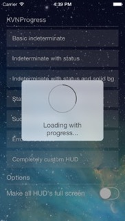](Images/screenshot_003.jpg)
[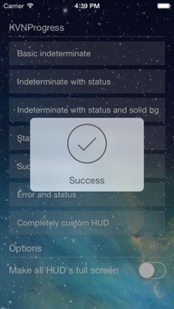](Images/screenshot_004.jpg)
[](Images/screenshot_005.jpg)
<br/>
Full screen interface:<br/>
[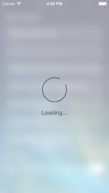](Images/screenshot_007.jpg)
[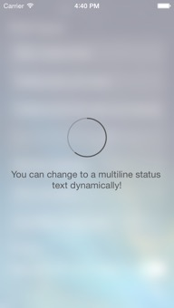](Images/screenshot_008.jpg)
[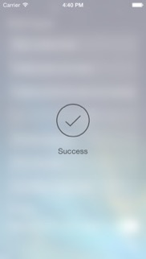](Images/screenshot_009.jpg)
[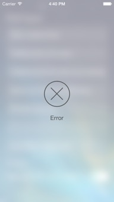](Images/screenshot_010.jpg)
<br/>
Example of customized interface:<br/>
[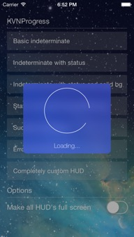](Images/screenshot_013.jpg)
[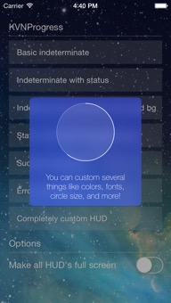](Images/screenshot_006.jpg)
[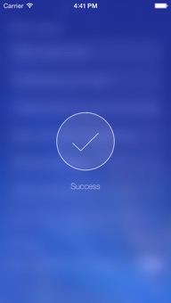](Images/screenshot_011.jpg)
[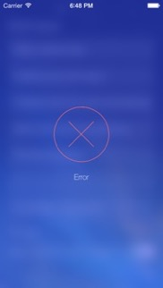](Images/screenshot_012.jpg)

## Advantages

 * [x] Can be full screen
 * [x] Uses `UIMotionEffect`
 * [x] Supports all orientations
 * [x] Supports iPad
 * [x] Animates text update
 * [x] Animates success checkmark
 * [x] Is well documented
 * [x] Is fully customizable
    * Colors
    * Fonts
    * Circle size and thickness
    * Blur or solid color background

## Demo

Here is a video of the demo app that you can find in this project.
If you want to try it yourself, just download/checkout this repository and launch the project in Xcode.

[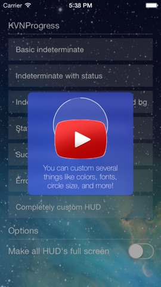](https://www.youtube.com/watch?v=aerOmPYG_NI)

## Installation

### Cocoapods

[CocoaPods](http://www.cocoapods.org) recommended to use KVNProgress.

1. Add `pod 'KVNProgress'` to your *Podfile*.
2. Install the pod(s) by running `pod install`.
3. Include KVNProgress wherever you need it with `#import <KVNProgress/KVNProgress.h>`.


### Source files

1. Download the [latest code version](http://github.com/kevin-hirsch/KVNProgress/archive/master.zip) or add the repository as a git submodule to your git-tracked project.
2. Drag and drop the **Classes**, **Categories** and also the **Resources** directory from the archive in your project navigator. Make sure to select *Copy items* when asked if you extracted the code archive outside of your project.
3. Include KVNProgress wherever you need it with `#import <KVNProgress/KVNProgress.h>`.

## Usage

Check out the provided demo app for many examples how you can use the components.

### Basics

KVNProgress HUD will block the user from interacting with the interface behind it.
You can customize colors, font and size of the HUD.

Add the following import to the top of the file or to your Prefix header:

   ```objc
   #import <KVNProgress/KVNProgress.h>
   ```

### Progress

#### Indeterminate progress

To show an indeterminate progress:

   ```objc
   [KVNProgress show];

   // Adds a status below the circle
   [KVNProgress showWithStatus:@"Loading"];

   // Adds the HUD to a certain view instead of main window
   [KVNProgress showWithStatus:@"Loading"
                        onView:view];
   ```

To change the status on the fly (animated):

  ```objc
   [KVNProgress updateStatus:@"New status"];
   ```

#### Determinate progress

To show a determinate progress and change its value along time:

   ```objc
   // Progress has to be between 0 and 1
   [KVNProgress showProgress:0.5f];

   // Adds a status below the progress
   [KVNProgress showProgress:0.5f
                      status:@"Loading"];

   // Adds the HUD to a certain view instead of main window
   [KVNProgress showProgress:0.5f
                      status:@"Loading"
                      onView:view];

   // Updates the progress
   [KVNProgress updateProgress:0.75f
                      animated:YES];
   ```

#### Stop button

You can add a stop button to a progress HUD. For this you will need to use the `KVNProgressConfiguration`(see [below](#KVNProgressConfiguration)). You simply have to put:

```objc
KVNProgressConfiguration *configuration = [KVNProgressConfiguration defaultConfiguration];
configuration.showStop = YES;
configuration.tapBlock = ^(KVNProgress *progressView) {
	// Do what you want
	[KVNProgress dismiss];
};

[KVNProgress setConfiguration:configuration];
```

`tapBlock` will be executed when HUD is tapped. If no `tapBlock` is specified, `showStop` will **not** be activated!

You can customize stop button size. Defaults to 30% of the circle size.

```objc
configuration.stopRelativeHeight = 0.3f;
configuration.stopColor = [UIColor whiteColor];
```

### Dismiss

To dismiss after your task is done:

   ```objc
   // Dismiss
   [KVNProgress dismiss];
   ```

**When necessary, you can use:**

   ```objc
   // Dismiss
   [KVNProgress dismissWithCompletion:^{
      // Things you want to do after the HUD is gone.
   }];
   ```

**Why?**

Because KVNProgress remains visible for a certain time even if you call `dismiss`. This is done to ensure the user has enough time to see the HUD if the `dismiss` is called too quick after a `show`.
The completion block in `dismissWithCompletion` is called (on the main thread) after the HUD is completely dismissed.
This minimum amount of display time is defined in the KVNProgressConfiguration object (explained [below](#display-times)). Default value is `0.3` seconds.

### Success/Error

To show a success HUD with a checkmark:

   ```objc
   [KVNProgress showSuccess];

   // Or
   [KVNProgress showSuccessWithStatus:@"Success"];

   // Adds the HUD to a certain view instead of main window
   [KVNProgress showSuccessWithStatus:@"Success"
                               onView:view];
   ```

To show an error HUD with a cross:

   ```objc
   [KVNProgress showError];

   // Or
   [KVNProgress showErrorWithStatus:@"Error"];

   // Adds the HUD to a certain view instead of main window
   [KVNProgress showErrorWithStatus:@"Error"
                             onView:view];
   ```

Dismiss is automatic for successes and errors. If you want to do something after the dismissal, you can use the above methods with the final parameter `completion`: `showSuccessWithCompletion:`, `showSuccessWithStatus:completion:`, `showSuccessWithStatus:onView:completion:`, `showErrorWithCompletion:`, `showErrorWithStatus:completion:`, `showErrorWithStatus:onView:completion:`.

## Customization

The appearance of KVNProgress is very customizable.
If something is missing or could be added, don't hesitate to ask for it!

### <a name="KVNProgressConfiguration"></a>KVNProgressConfiguration

You can setup your HUD UI in your UI setups for your app using the `KVNProgressConfiguration`.
Here is an example on how to simply set the default configuration for you HUD:

   ```objc
   [KVNProgress setConfiguration:[KVNProgressConfiguration defaultConfiguration]];
   ```

Note that if you just want the default configuration, the above code is not needed.
If you do not set a configuration, the default one is taken ;)

Here is an example of a complete custom configuration:

  ```objc
   KVNProgressConfiguration *configuration = [[KVNProgressConfiguration alloc] init];

	configuration.statusColor = [UIColor whiteColor];
	configuration.statusFont = [UIFont fontWithName:@"HelveticaNeue-Thin" size:15.0f];
	configuration.circleStrokeForegroundColor = [UIColor whiteColor];
	configuration.circleStrokeBackgroundColor = [UIColor colorWithWhite:1.0f alpha:0.3f];
	configuration.circleFillBackgroundColor = [UIColor colorWithWhite:1.0f alpha:0.1f];
	configuration.backgroundFillColor = [UIColor colorWithRed:0.173f green:0.263f blue:0.856f alpha:0.9f];
	configuration.backgroundTintColor = [UIColor colorWithRed:0.173f green:0.263f blue:0.856f alpha:1.0f];
	configuration.successColor = [UIColor whiteColor];
	configuration.errorColor = [UIColor whiteColor];
	configuration.stopColor = [UIColor whiteColor];
	configuration.circleSize = 110.0f;
	configuration.lineWidth = 1.0f;
	configuration.fullScreen = NO;
	configuration.showStop = YES;
	configuration.stopRelativeHeight = 0.4f;

  configuration.tapBlock = ^(KVNProgress *progressView) {
    // Do something you want to do when the user tap on the HUD
    // Does nothing by default
  };

  // You can allow user interaction for behind views but you will losse the tapBlock functionnality just above
  // Does not work with fullscreen mode
  // Default is NO
  configuration.allowUserInteraction = NO;

	[KVNProgress setConfiguration:configuration];
   ```

If you do not specify certain properties for a configuration, they will automatically be the default's one.


### Display times

To avoid the user to see a blinking HUD or even don't see it at all if you are dismissing it too quickly, the HUD will stay display for a minimum (short) period of time.

There are 3 properties you can change that do that in `KVNProgressConfiguration` to do that:

* `minimumDisplayTime` that has a default value of `0.3` seconds. It handles all HUD's except for success and error ones.
* `minimumSuccessDisplayTime` that has a default value of `2.0` seconds. It handles all success HUD's.
* `minimumErrorDisplayTime` that has a default value of `1.3` seconds. It handles all error HUD's.

## Known bugs

 * Showing an HUD on `alertView:clickedButtonAtIndex:` will give an undefined behavior that can sometimes make the HUD not appear ([#29](https://github.com/kevin-hirsch/KVNProgress/issues/29) - [resolution comment](https://github.com/kevin-hirsch/KVNProgress/issues/29#issuecomment-77602300)). Instead, call the HUD on `alertView:didDismissWithButtonIndex:` to be sure the `UIAlertView` is completely dismissed before showing an HUD.

## Remains to do

- [ ] Use real-time blur

## Requirements

* Xcode 6
* iOS 7
* ARC
* Frameworks:
    * QuartzCore
    * GLKit

## License

This project is under MIT license. For more information, see `LICENSE` file.

## Credits

KVNProgress was inspired by [MRProgress](https://github.com/mrackwitz/MRProgress) UI.

KVNProgress was done to integrate in a project I work on: [Assisto](https://assis.to).
It will be updated when necessary and fixes will be done as soon as discovered to keep it up to date.

I work at [Pinch](http://pinchproject.com).

You can find me on Twitter [@kevinh6113](https://twitter.com/kevinh6113).

Enjoy! :)
